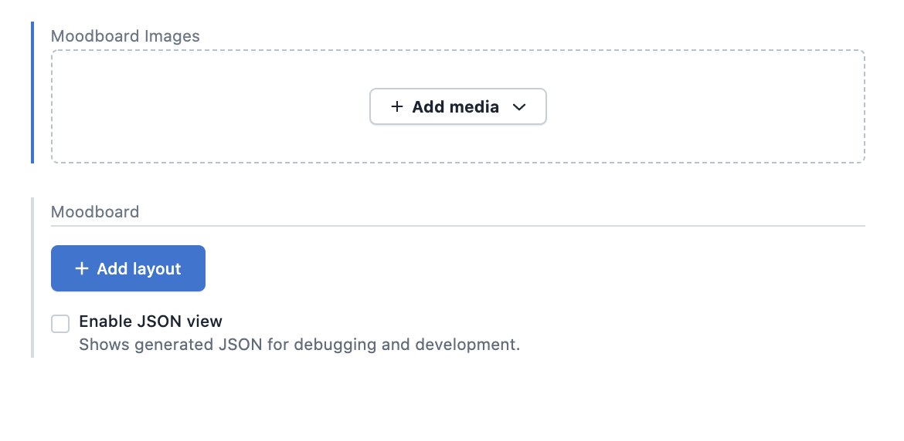
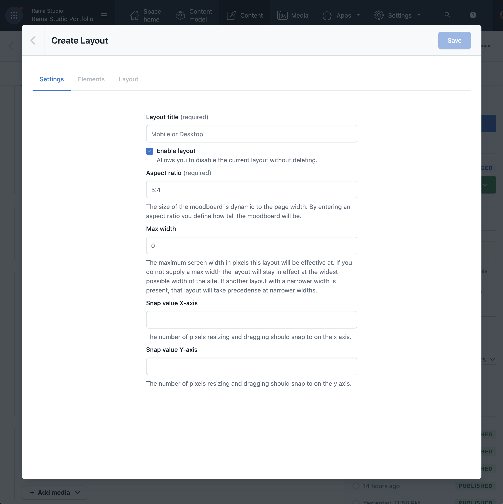
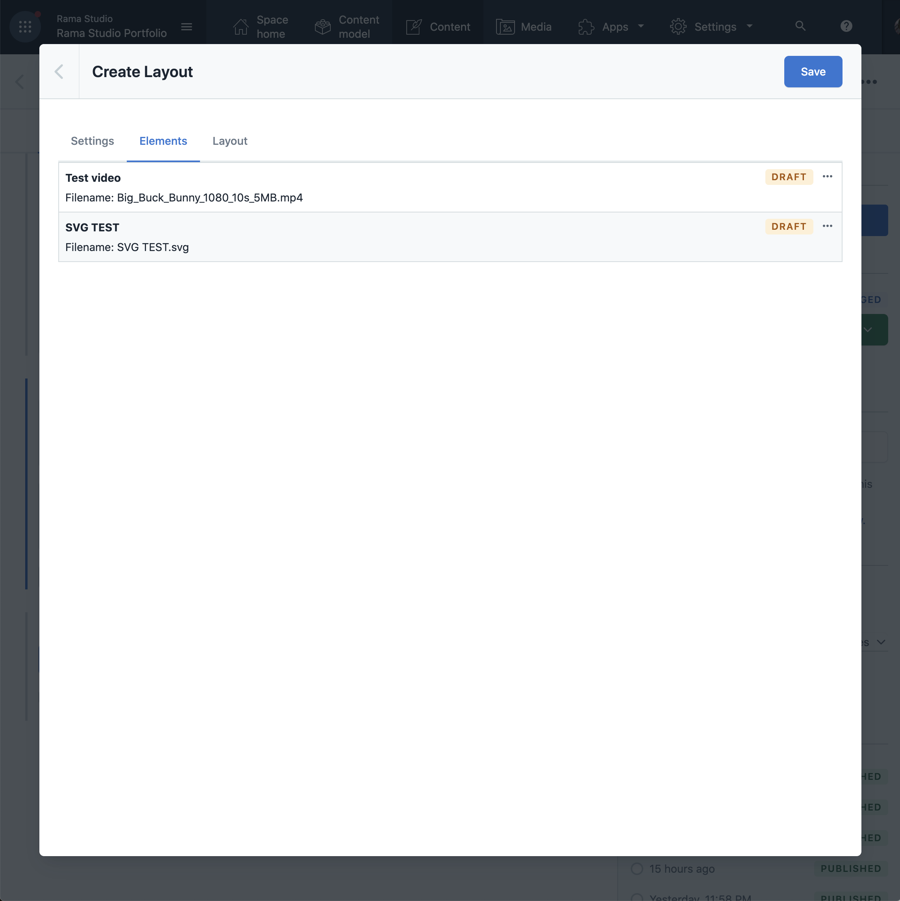
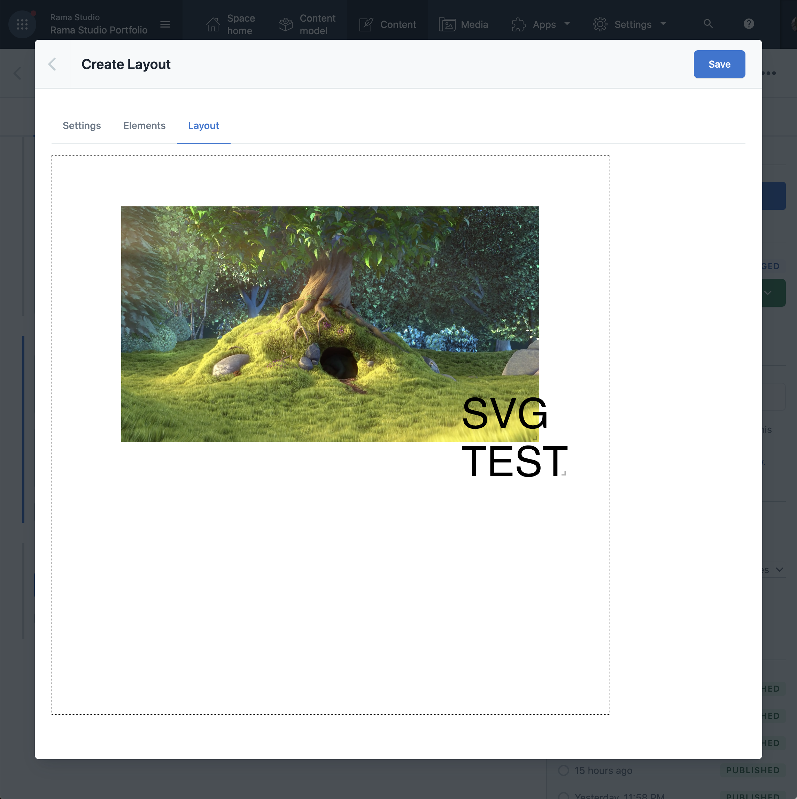
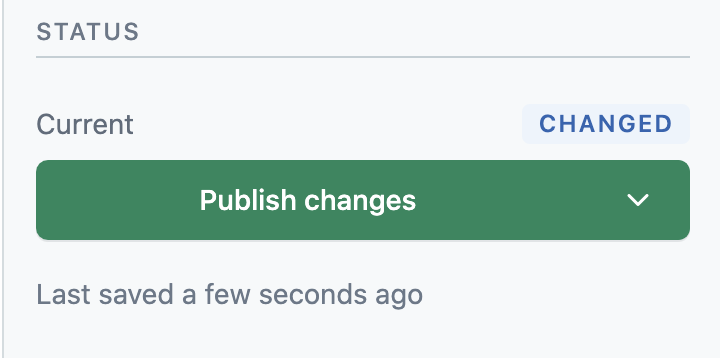

# Contentful Moodboard Editor

The Contentful Moodboard Editor is an extension to Contentful that will provide you with a WYSIWYG ("what you see is what you get") editor to layout images, videos and text into a "moodboard".

## Installation and setup

TODO

## How to use

When the editor is correctly set up you should see two new fields on your content type:

- "Moodboard Images": A standard Contentful asset field that allows you to add images and videos to be used in the moodbard.
- "Moodboard": A field that will allow you to create drag and drop based layouts to be displayed on your page.

Here is how to get started:

1. Click "Add media" under "Moodboard Images" and choose between using previously uploaded assets or uploading a creating a new asset.

2. If it is an image, feel free to crop and resize the asset at this stage. You may want multiple version of the same image with different crops and or sizes so you can choose which one to use on mobile and desktop layouts correspondingly.

3. After adding one or more assets, click "Add layout" in the "Moodboard" field. This will take you to the "layout settings" screen:

You can create multiple layouts for the same content type. This is intended for creating custom mobile and desktop layouts. This screen will allow you to specify basic settings for a layout:

- Layout title: Use a title you can recognize. The same title cannot be used twice on the same content type instance (i.e. typically a page), but can reuse the same names every time you configure a new instance. It is suggested starting with a mobile layout, so for this example call it "Mobile".
- Enable layout: If you're working on a layout and want to make sure it is not displayed even if the content type instance is published, you can disable the layout here.
- Aspect ratio: Since the width of the layout is set by the width of the users browsers we would be doing us self a disservice by refering to the dimensions of the page in absolute numbers. Aspect ratio is essentially a control to specify the height of the page relative to the width. So if you specify a ratio of 1:2, the layout will be twice as high as it is wide. So at a width of 1000 pixels the canvas will be 2000 pixels tall.
- Max-width: This is the control that allow you to specifify which layout will be displayed at a given display width. Leaving it at 0 means "infinite" and means that the layout will continue to be used up to the widest possible display size. Specifying a lower value (for example 800) means that the current layout will only be displayed up to 800px width, but it also means that this layout will take precedence over any layouts with a "wider" max-width (including 0). A good starting setup would be to configure a mobile layout at 800 and a desktop layout at 0, meaning that the mobile layout will be displayed from 1-800 pixel width and the desktop layout will be displayed at 801 pixels width and higher. If you want to add a "tablet" layout, try specifying it at 1000. Since it is narrower than desktop it will take precedence, but mobile is still narrower than tablet so under 800 mobile will take precedence. You can add as many layouts as you want.
- Snap value x-axis: Allow you to let elements snap to an invisible grid when you are layouting. This control only affect the x-axis. If you need to place some elements on a grid and some elements freely, you can return to this page and remove the snap value while editing the layout.
- Snap value y-axis. Same as above, but for the y-axis.

4. After filling out the required fields (i.e. title and aspect ratio) it will be possible to navigate to the next screen. Layout elements:

This screen can be used to enable and disable assets. An asset can be either in "draft" or "published" state. Draft means that the asset is not being displayed on the currently layout, but since it was added to the asset field in the first step, it is still available to any other layout you might have. To be able to layout an asset on the given layout you need to publish it by pressing the `···` icon and pressing publish (you unpublish from the same menu).

If you choose to load mulitple versions of the same asset (i.e. multiple crops, resizes or small variations of the same asset) you can apply the principle of "art direction" to use assets taylored for a given layout. Just enable one version of the asset in the mobile layout and another one in the desktop layout.

5. Once you published at least one of your assets you can continue to the "Layout" screen:

6. On this screen you can reposition elements by dragging them and resize elements by pulling the small "handle" in the lower right corner. Keep an eye out for the rectangle outlined by a thin dotted line. This represent the bounds of your canvas. To change the size of the canvas refer to the aspect ratio control on the settings page.

7. Once the layout is done you can save it. If you regret any of the changes you made in the editor before saving, you can always press the "back" button in the upper right corner, which will revert everything back to what it was before you started editing.

8. Note that all the edits you performed are saved to a "field" in contentful which works just the same as if you were typing into the field. This means that even though you have saved your changes to the field, your edits will still not show on the website. For your changes to show you need to press "publish" in the Contentful sidebar.

